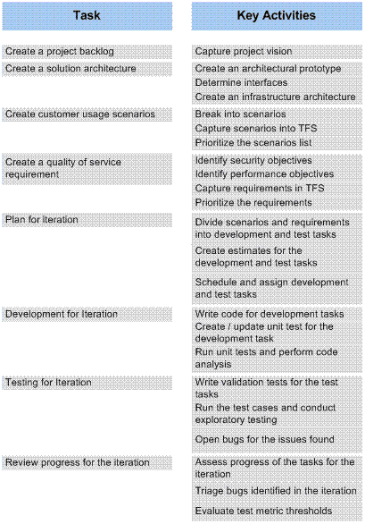

### Chapter 14 - MSF for Agile Software Development Projects
- _[J.D. Meier](http://blogs.msdn.com/jmeier), [Jason Taylor](http://jtaylorgoodlife.blogspot.com/), Alex Mackman, [Prashant Bansode](http://prashantbansode.blogspot.com/), [Kevin Jones](http://blogs.advantaje.com/blog/kevin/)_

### Objectives
* Learn when to use the Microsoft® Solution Framework (MSF) for Agile Software Development (MSF Agile) process template.
* Identify how teams typically use the MSF Agile process template.
* Customize the MSF Agile process template to meet your team’s specific needs.

### Overview
The process defined by the MSF Agile process template incorporates key ideas from the Agile software movement, along with principles and practices from MSF. The process supports an agile software engineering strategy that uses multiple iterations and a scenario-based approach for building applications. The template provides the automation and guidance necessary to support your team development, including configuration management, project management, work item tracking, and a project portal for communication.

This chapter explains the workflow of a typical MSF Agile software development project, shows examples of teams using MSF Agile process, and describes the default template settings and what options you have to customize in the supplied template.

### How to Use This Chapter
Read this chapter if you want to gain a better understanding of how the MSF Agile process template and process guidance works as well as how it is has been used successfully by various teams. To gain the greatest benefits from this chapter, you should:
* **Read “MSF for Agile Software Development Defaults” section**. To understand the details of the MSF Agile process template including default reports, work items, and permissions. 
* **Read through the “Examples of MSF for Agile Software Development in Practice” section.** To see how real teams have successfully used MSF Agile to develop and release applications.
* **Read “Chapter 13, Process Templates Explained.”** If you would like to learn more about process templates in general, read “Chapter 13 - Process Templates Explained.” 

### Workflow for MSF for Agile Software Development
The MSF Agile process template defines a set of tasks to be performed during iterations by the various roles involved in a software-development lifecycle including business analysts, architects, project managers, developers, and testers. Figure 14.1 shows the key activities associated with each of the defined task.
 

**_Figure 14.1** MSF Agile Tasks and Key Activities_
### MSF for Agile Software Development Defaults
When you create a new team project by using the MSF Agile process template, a concepts page outlining the process guidance is displayed in the main window of Microsoft Visual Studio®. This is your initial viewpoint into the MSF Agile process. You can also access this information from the project portal home page.

The configuration of the tooling goes well beyond the description of the process and includes work items (such as scenarios, quality of service requirements, tasks, bugs, and risks), project reports, roles (groups and permissions), and a project portal. Key items supplied by the MSF Agile template include: 
* Work items
* Groups and permissions
* Source control
* Areas and iterations
* Reports
* Portal

The following sections detail the important defaults available to you when using the MSF Agile process template.

### Work Items
The MSF Agile process template contains the following work item types:
* **Bug**. Represents a problem or potential problem in your application.
* **Risk**. Represents a possible event or condition that would have a negative impact on your project.
* **Scenario**. Represents a single path of user interaction through the system you are building.
* **Task**. Identifies a specific item of work for a team member to perform.
* **Quality of Service Requirement**. Represents a non-functional requirement such as a security, performance or manageability requirement.  

When you create a new team project based on the MSF Agile process template, the following work items are created for you. This saves you work by providing you with a common set of tasks that you need to perform at project initiation. 
* **Set up: Set Permissions**. The purpose of this task is to add team members to one of the four security groups: Build Services, Project Administrators, Contributors, or Readers.
* **Set up: Migration of Source Code.** The purpose of this task is to migrate your existing source code from Microsoft Visual SourceSafe®, if you are moving an existing project to Microsoft Visual Studio Team Foundation Server (TFS). You should complete migration of source code before you grant team members access to the team project.
* **Set up: Migration of Work Items.** If you are bringing an existing project into TFS, you can migrate work items such as bugs and tasks from Clearquest or a comma-separated value (CSV) file. You should complete this migration of work items before you grant team members access to the team project.
* **Set up: Set Check-in Policies**. The purpose of this task is to setup the business rules or policies that surround source code check-ins.
* **Set up: Configure Build**. The purpose of this task is to create an initial source tree and set up the build to run on a periodic (usually daily) basis.
* **Set up: Send Mail to Users for Installation and Getting Started**. The purpose of his task is to send an e-mail to team members that provides information about which TFS they should connect to, and which team project they should use to get started working on the team project.
* **Create Vision Statement.** The purpose of his task is to create a vision statement for the project ― a view of the desired end result of your project, shared by all project stakeholders.
* **Set up: Create Project Description on Team Project Portal**. The purpose of this task is to change the default project description to better describe the new team project, for example describing project’s purpose, goals, or vision.
* **Create Personas**. The purpose of this task is to create personas that represent users interacting with the system. You can use the personas when thinking through application design as they are the target users for the system.
* **Define Iteration Length.** The purpose of this task is to define the iteration cycle to be used by the project. This depends upon the size and complexity of the project.
* **Create Test Approach Worksheet including Test Thresholds**. The purpose of this task is to understand your test strategy from the very start of the project iteration.**** Understanding your test approach can help you schedule your testing tasks more efficiently and will allow your developers to implement with the test considerations in mind.
* **Brainstorm and Prioritize Scenarios List**. The purpose of this task is to identify and prioritize key usage scenarios.
* **Brainstorm and Prioritize Quality of Service Requirements List.** The purpose of this task is to identify non-functional QoS requirements such as security, performance and manageability scenarios.
* **Set up: Create Project Structure.** The purpose of this task is to create the project structure that captures the areas in which the development team will be working in.
* **Create Iteration Plan**. The purpose of this task is to decide how to divide your development efforts into iterations.

### Reports
The following reports are available by default with the MSF Agile process template:
* **Bugs by Priority**. Are the correct bugs being found? This report shows you the rate of high-priority versus low–priority bugs being found.
* **Bug Rates.** How effectively are bugs being found, fixed, and closed? This chart shows trends over time for new bugs, bug backlogs, and bug resolution.
* **Builds**. What is the quality of a build? This report provides a list of available builds including build quality and other detailed information.
* **Project Velocity.** How quickly is the team completing its work? This report shows how quickly the team is completing planned work and shows rates of change from day to day.
* **Quality Indicators.** What is the quality of the software? This report collects test results, bugs, code coverage, and code churn into a single report in order to track project health.
* **Load Test Summary**. This report shows test results for load testing on your application.
* **Regressions**. This report shows a list of all the tests that previously passed but are now failing.
* **Reactivations.** How many work items are being reactivated? This report shows work items that have been resolved or closed prematurely.
* **Related Work Items.** What work items are dependent on other work items? This report shows a list of work items that are linked to other work items so you can trace dependencies.
* **Remaining Work.**  How much work is left to be done and when will it be completed? This report shows the amount of work that is remaining, resolved and closed over time.  Projecting remaining work trends forward can enable you to predict the point at which you will be code complete.
* **Unplanned Work**. How much unplanned work is there? This report charts total work versus remaining work and distinguishes planned from unplanned activities.
* **Triage.** What work items need to be triaged? This report shows every work item that is still in the proposed state.
* **Work Items**. What are the active work items? This report lists every active work item.
* **Work Items by Owner.** How much work is assigned to each member of the team? This report shows work items per team member.
* **Work Items by State**. How many active, resolved and closed work items are there? This report shows lists every active, resolved, and closed work item.

### Groups and Permissions
The following groups are available by default in the MSF Agile process template:
* **Readers**. Members of this group have read-only access to the team project.
* **Contributors**. Members of this group can add, modify, and delete items within the team project.
* **Build** **Services**. Members of this group have build service permissions for the team project. This group is used for service accounts only.
* **Project Administrators**. Members of this group can perform all operations in the team project.

### Source Control
MSF Agile uses the following default source control settings:
* **Multiple Checkout.** By default MSF Agile allows multiple checkouts to enable multiple team members to work on the same file at the same time. Any resulting conflicts must be resolved at check-in time.
* **Permissions.** The default permissions on the source control are as follows:
	* **Project Administrators.** Have all available rights.
	* **Build Services**. Have rights to read, pend changes, check-in, label, start build, and edit build.
	* **Contributors.** Have rights to read, pend changes, check-in, check-out, label, and start build. 
	* **Readers**. Has only read-only access to source control

### Areas and Iterations
The out-of-box MSF Agile process template does not provide a classification structure for either areas or iterations. The recommended approach is to carve out the areas based on the component or features of the project. Iterations can be time-based cycles for which you will repeat a particular set of major activities such as plan, develop, and test.

### Examples of MSF for Agile Software Development in Practice
The following examples show how the MSF for Agile Software Development process has been adopted and used by the _patterns & practices_ team within Microsoft as well as by a development team outside of Microsoft.

#### Example 1: patterns & practices Teams
The following example shows how a typical _patterns & practices_ project is executed by using the MSF Agile process.

##### New Project Through Iteration 0
* The product manager:
## Interacts with customers and stake holders to gather project requirements. These are captured in a Microsoft Office Word document named the Project Back Log.
## Creates a vision statement for the project by using Microsoft Office PowerPoint®.
## Brainstorms with customers and various stakeholders and defines the scenarios that will address the project’s requirements and vision.
## Works with the project manager and other stakeholders to prioritize the scenarios.
* The project manager:
## Captures the scenarios as work items in TFS.
## Decides the iteration cycle duration, depending on the project size, and delivery capabilities.

##### Pre-Iteration Planning
* The project manager decides which scenarios should be worked on during the iterations, depending on their priority.
* The product manager together with the project manager creates Quality of Service (QoS) Requirements for the scenario. The QoS is then linked to the scenarios.

##### Iteration Planning
* The project manager:
## Breaks the scenarios into development tasks, in collaboration with developers and other team members. 
## Captures the development tasks in TFS and links them to the scenarios. 
## Defines the acceptance criteria for each of the development tasks.
## Breaks the QoS requirements into test tasks.
## Captures the test tasks in TFS and links them to the QoS 
## Defines the acceptance criteria for each of the test tasks.
## Schedules and assigns the tasks.
* The developer estimates each development task. 
**Important** – If it looks like the tasks (developer stories) might take longer than a day or two to implement, then you should break these down into sub-stories.
* The tester, provide estimation for each of the test tasks.

##### During the Iteration
* The project manager guides the iteration.
* The developer, writes code for the development task, and then closes the tasks once the acceptance criteria have been met.
* The tester executes the test tasks that he or she is assigned and then creates new bugs (work items) for any issues identified. 

##### After the Iteration
* The project manager:
## Assesses the project progress and reprioritizes any scenarios that are incomplete from the current iteration. 
## Provide a status report to stakeholders.
## Decides which scenarios should be worked on during next iteration based on their priority.
* The product manager:
## Adds any newly discovered scenarios. 
## Reprioritizes scenarios (where necessary).
## Together with the project manager, creates QoS requirements for the project. The QoS is linked to the scenarios.

#### Example 2: Field Customer Engagement
The following example shows how the MSF Agile process is used by a field customer engagement.

##### New Project Through Iteration 0
* The business analyst:
## Creates a short (one-page) vision statement.
## Identifies an on-site customer who can be used to provide input and creates personas for the system.
## Brainstorms scenarios (names only) with the customer.
## Prioritizes scenarios with the customer.
## Writes scenarios for the upcoming iteration.
* The project manager:
## Gathers the developers together and obtains their estimates. The estimates are rough- order-of-magnitude estimates. 
## Checks if priorities change as a result of costs.
## Schedules scenarios for the upcoming iteration.
* The architect divides scenarios into architecture tasks.
* The developer:
## Divides scenarios into development tasks.
## Defines an appropriate build strategy (Continuous Integration if possible).
* The tester divides scenario into test tasks.

##### During the Iteration
* The project manager:
## Guides the iteration.
## Guides the project.
* The architect defines the solution architecture.
* The developer, implements a development task.
* The tester, tests a scenario.

##### After Iteration 0
The tasks change slightly at this point.
* The business analyst:
## Updates personas (where necessary).
## Adds any newly discovered scenarios.
## Reprioritizes scenarios (where necessary).
## Writes scenarios for the upcoming iteration.
* The project manager:
## Estimates any new scenarios.
## Schedules scenarios for the upcoming iteration.
* The architect divides the scenarios into architecture tasks.
* The developer:
## Divides scenarios into development tasks.
## Updates the build process (Continuous Integration if possible).
* The Tester divides the scenarios into test tasks.

### Customizing the MSF Agile Process Template
You can use two methods to customize the MSF Agile process template to suit your specific organizational requirements:
* **Manually customize the XML files**. Manual customization is error-prone but nevertheless gives you fine grained control on the customization of the process templates. For more information, see “Customizing Process Templates” at [http://msdn2.microsoft.com/en-us/library/ms243782(VS.80).aspx](http://msdn2.microsoft.com/en-us/library/ms243782(VS.80).aspx), 
* **Process Template Editor**. The latest version of the Visual Studio 2005 Team Foundation Server Power Tool ? a set of enhancements, tools, and command-line utilities that improve the TFS experience ? provides you with a user interface-based tool, that you can use to view and customize process templates. When connected to TFS, you can use this tool to customize work item type definitions and global lists on an active project. For more information, see “How To: Customize a Process Template in Visual Studio Team Foundation Server.”

### Summary
The MSF Agile process template defines a set of tasks to be performed by the various roles involved in a software-development lifecycle. The MSF Agile process template defines work items, groups and permissions, source control, areas and iterations, reports and a team portal in order to support the agile process.

If the default process template does not satisfy your process requirements, you can customize the template by manually customizing the XML process definition files or by using the Process Editor Tool that ships with TFS Power Tools.

### Additional Resources
* To download the MSF Agile process template, go to [http://www.microsoft.com/downloads/details.aspx?FamilyID=EA75784E-3A3F-48FB-824E-828BF593C34D&displaylang=en](http://www.microsoft.com/downloads/details.aspx?FamilyID=EA75784E-3A3F-48FB-824E-828BF593C34D&displaylang=en)
* To download the Team Foundation Server Power Tool including the Process Template Editor, go to [http://msdn2.microsoft.com/en-us/vstudio/aa718351.aspx](http://msdn2.microsoft.com/en-us/vstudio/aa718351.aspx) 
* For more information on process template customization, see “Process Template Customization Overview” at [http://msdn2.microsoft.com/en-us/library/ms194945(VS.80).aspx](http://msdn2.microsoft.com/en-us/library/ms194945(VS.80).aspx) 
* For more information about how to manually customize process templates, see “Customizing Process Templates” at [http://msdn2.microsoft.com/en-us/library/ms243782(VS.80).aspx](http://msdn2.microsoft.com/en-us/library/ms243782(VS.80).aspx)