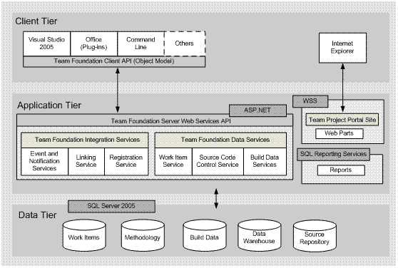
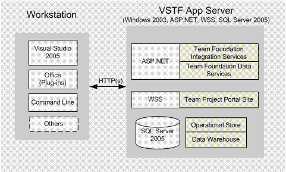
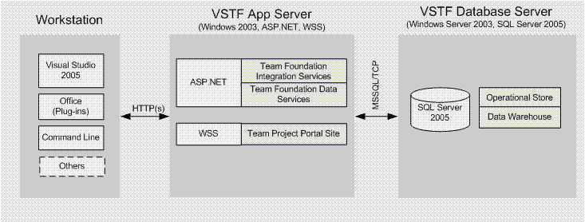
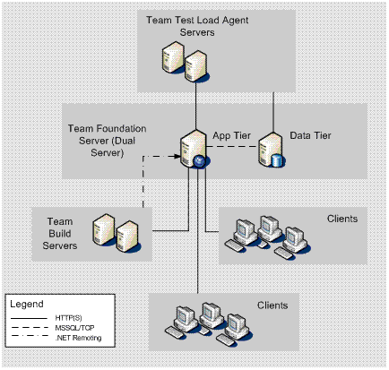

### Chapter 16 - Team Foundation Server Deployment
- _[J.D. Meier](http://blogs.msdn.com/jmeier), [Jason Taylor](http://jtaylorgoodlife.blogspot.com/), Alex Mackman, [Prashant Bansode](http://prashantbansode.blogspot.com/), [Kevin Jones](http://blogs.advantaje.com/blog/kevin/)_

### Objectives
* Learn about the advantages and disadvantages of single-server and multiple-server deployments.
* Select a deployment topology to suit your organization’s requirements.

### Overview
This chapter outlines the main approaches to deploying Microsoft® Visual Studio® 2005 Team Foundation Server (TFS) and describes key decision points you will face when deploying TFS in your organization. The chapter explains the two deployment options and describes how to choose between these options.

There are two TFS deployment options, single-server or dual-server installation. A single-server installation places the data-tier and application-tier on a single server. A dual server installation splits the application and data tiers onto separate servers. Additionally, you can install the build server and the source control proxy on separate servers. Each client requires access to the servers and the appropriate client-side tools must be installed.
### How to Use This Chapter
Use this chapter to determine your TFS deployment strategy. To gain the greatest benefits from this chapter, you should:
* **Understand TFS Architecture**. Make sure that you fully understand TFS architecture. If you are unfamiliar with the Team Foundation Server architecture read the “TFS Architecture” section, or read “Chapter 2 – Team Foundation Server Architecture” for more information.
* **Choose a deployment strategy**. Choose the deployment strategy that best suits your organization’s needs. If you have not already done so, read the “Deployment Scenarios” section to determine which deployment strategy will work best for your team.

### TFS Architecture
Figure 16.1 shows TFS architecture. 

 
**_Figure 16.1** TFS Architecture_

TFS architecture is made up of three tiers, the data tier, the application tier and the client tier. These are logical separations, and all three tiers can be installed onto the same computer. 

The Team Foundation data tier consists of Microsoft SQL Server™ 2005. A number of databases are installed that store the work items, the version control system, test results and any reports.

The application tier contains a Web-based front end integrated into Internet Information Services (IIS), the Team Foundation Web services, and Microsoft Office SharePoint® services. The application tier also contains any build servers and source control proxy servers.

The client tier contains the applications that access TFS. Developers use Team Explorer to connect to Team Server, installed either as a stand-alone tool or as part of Visual Studio 2005. Project Managers use Microsoft Office Excel® or Microsoft Office Project. You can also use third-party tools to connect to the server.

For more information, see “Chapter 2 – Team Foundation Server Architecture.”

### Deployment Scenarios
You can deploy TFS in the following ways:
* Single-server deployment
	* Within a workgroup.
	* Using Microsoft Active Directory ® directory service.
* Dual-server deployment

#### Single-Server Deployment with Workgroup 
With this deployment approach, you create a workgroup where you have no Active Directory domain controller. You use this installation mode when you have a small team. If you use this installation mode, each user requires a local account on the server to enable them to log on to the server. For this type of deployment you can only install onto a single-server, and dual-server installation is not supported.

#### Single-Server Deployment with Active Directory
If you have an Active Directory, then you have two deployment choices. You can install both the data tier and the application tier on the same server, or you can install the data tier and the application tier on separate servers.

#### What Is the Right Type of Deployment for My Organization?
To decide whether a single-server or dual-server install is the right choice for your organization, consider the following questions:
* **How many users do I need to support?**   If you plan to have more than 400 users, consider whether a dual-server deployment might better suit your needs.
* **How many projects will I be supporting with TFS?**   If you are supporting a large number of projects, consider whether a dual-server TFS deployment might better suit your business needs. Each TFS instance can support up 5000 projects. If you need to support more than 5000 projects then consider setting up more than one Team Foundation Server instance.
* **Do I have a server I can dedicate to TFS?**  The server in a single-server Team Foundation Server deployment should be dedicated to TFS functionality. The TFS should not serve any other purpose, such as being a mail server, file server, or database server for other applications.

##### Advantages of Single-Server Deployments
Consider the following advantages when deciding whether to implement a single-server deployment:
* **Simplicity**   
	* You can manage all aspects of TFS deployment on a single-server. 
	* You can configure all access rights and permissions for users and groups on one server. 
	* You only have one server to schedule for backup and maintenance. 
* **Availability**   Because both the application tier and the data tier are present on a single server, you do not have to consider network restrictions or network latency between the application tier and data tier when planning your deployment.

##### Advantages of Dual-Server Deployments
Consider the following advantages when deciding whether to implement a dual-server deployment:
* **Scalability.** Single-server deployments are designed for up to 400 users, while a dual-server deployment will allow you to scale beyond this limit up to 2000 users.
* **Fail-over. **You can redirect the application-tier server to a different data-tier server in case of maintenance or repairs, and you cannot configure and deploy an additional server that can act as a standby or fail-over application-tier server.

#### Single-Server Deployment
Figure 16.2 shows a typical single server deployment. Installed on the server are the TFS application and data tiers, along with SharePoint Services and SQL Server 2005. 

 
_Figure 16.2 Typical Single-Server Installation_

#### Dual-Server Deployment
Figure 16.3 shows a typical dual server installation. The TFS application tier is installed along with SharePoint Services on one tier. The TFS data tier is installed alongside SQL Server 2005 on another server. 

 
_Figure 16.3 Typical Dual-Server Installation_

#### Other Servers
In either the single-server or dual-server installation, you can install a separate build server as well as a proxy server. These can be installed onto the same server as the application-tier or on different servers.

##### Build Server Installation
You can locate your build services on a separate server to improve build performance and reduce the load on your application tier. For example, if your application tier server performance is impacted by frequent builds, consider moving the build services to a separate server.

##### Team Foundation Proxy Server
The Team Foundation proxy server caches copies of source control files. You should use the proxy server if you are accessing the source control server over a network and there is high latency. 

### Team Foundation Server Topologies
After you have decided on either single-server or dual-server installation, there are several topologies you can use. Topologies range from simple to complex. Each topology is designed for teams of certain sizes.

#### Simple Topology
Figure 16.4 shows a simple topology where the TFS application-tier and data-tier components are deployed to a single server. The TFS proxy server is deployed to a separate server. The server can be accessed from client workstations in the same domain. 

This configuration is appropriate for development teams or pilot projects with up to 400 users. 

_Figure 16.4 Simple Team Foundation Server Topology_

#### Moderate Topology
Figure 16.5 shows TFS installed onto different tiers. The application services are deployed onto one application-tier node and the databases onto a separate data-tier node. 

_Figure 16.5 Moderate Team Foundation Server Topology_

Figure 16.5 also shows a test rig and some build servers deployed to separate nodes. The client nodes are either in the same domain as the servers or in a domain that has a trust relationship with the servers. Topologies of this complexity are targets for larger development teams in the range of 400 to 2000 users.

#### Complex Topology
The complex topology shown in Figure 16.6 is similar to the moderate topology. However, in this topology fail-over components have been added with an application-tier standby server and a data tier with SQL clustering technologies.

 
_Figure 16.6 Complex Team Foundation Server Topology_

Figure 16.6 also shows a geographically distant child domain that uses a limited-bandwidth connection. These clients use the TFS proxy server to improve access times to source control. 

#### Additional Considerations
When deploying TFS consider the following:
* If you already have a SharePoint server set up and want to use this to host your Team Foundation Server SharePoint site you can move the TFS SharePoint site to another server.  For more information, see [http://blogs.msdn.com/bharry/archive/2006/10/30/moving-your-tfs-sharepoint-site.aspx](http://blogs.msdn.com/bharry/archive/2006/10/30/moving-your-tfs-sharepoint-site.aspx)  
* Moving the OLAP engine and cube to a third machine has proved beneficial for larger teams. You can setup SQL clustering on the data tier, and have an active/active configuration with SQL on one node, and OLAP on the other, each acting as failover for its twin.  For more information, see: [http://msdn2.microsoft.com/en-us/library/aa721760(vs.80).aspx](http://msdn2.microsoft.com/en-us/library/aa721760(vs.80).aspx) and [http://msdn2.microsoft.com/en-us/library/ms252505(VS.80).aspx](http://msdn2.microsoft.com/en-us/library/ms252505(VS.80).aspx)

### Team Foundation Server Scaling and Backup Strategy
As part of your installation and deployment of Team Foundation Server you must decide how you are going to manage the backup and failover of your servers. The backup and failover strategies you choose depend on the size of the installation and the facilities and resources available to your organization. Because the data-tier is built on SQL Server 2005 the strategies you adopt are based on the approach you currently take to SQL Server backup. 

If you currently mirror or cluster SQL Server 2005 installations then you can take the same approach to the TFS data-tier. You also need to decide how to manage failure of the application-tier server. If you want to support application-tier failover, you will need a backup application-tier server in place and must be able to fail over to that server quickly.

#### Choose the Appropriate Installation and Backup/Recovery Strategies for Your Company.
When installing TFS you need to make several choices about the installation and backup/recovery strategies. Take the following things into consideration when deciding on your installation strategy:
* Size of teams
* Number of projects
* Size of projects
* Location of teams
* Failover needs
* Backup needs

#### Recommended Team Foundation Server Hardware
Generally, smaller teams with fewer projects can run on a single tier installation, while larger teams require dual tiers and faster hardware. The choice of single-tier versus dual-tier installation also impacts your backup and failover mechanisms.

Use Table 16.1 to help decide on a single-tier or dual-tier installation and to identify the hardware needed to support your team.

||Configuration                      	||Tiers	||CPU	||Hard Disk Drive	||Memory||
||One server, fewer than 20 users 	||Application-tier and data tier server    	||  Single processor, 2.2 gigahertz (GHz)       	||8 gigabytes (GB)             	||1 GB||
||One server; 20 to 100 users       	||Application-tier and data tier server    	||Dual processors, 2.2 GHz        	||30 GB	||2 GB||
||Two servers; 100 to 250 users     	||Application-tier server             	||Single processor, 2.2 GHz       	||20 GB	||1 GB||
||	|| Data-tier server                    ||Dual processors, 2.2 GHz        	||80 GB            	||2 GB||
||Two servers; 250 to 2000 users 	||Application-tier server             	||Dual processors, 2.8 GHz        	||40 GB	||4 GB||
||	||Data-tier server                    	||Quadruple processors, 2.7 GHz   	||Direct attach storage, 14,000 – 15,000 RPM RAID 0 spindles	|| 16 GB||

**Table 16.1** _Required hardware for TFS deployment_

#### Backup and Failover Strategy
When considering your backup and failover strategy you need to take into account the impact of losing a server on your team’s productivity.

##### Backup 
You should plan your backup strategy as part of the deployment of you TFS installation. You must consider:
* The frequency of your backup.
* The frequency of full and incremental backups.
* The storage requirements for the backup, such as on-site and off-site backup.

You can use the same standard backup practices that you use for any SQL Server 2005 database.

You can use backups to restore TFS in the following three scenarios:
* Data-only recovery.
* Single-server deployment full recovery.
* Dual-server deployment full recovery.

Data-only recovery is used if the data tier becomes corrupted. You can use the backup data and logs to recover the full database.

Server recovery is used when the servers fail. In this case, you can restore the full database to a second computer.

##### Application-Tier Standby Server
Although there is no data to backup on your application-tier servers, the servers can still fail. To mitigate the cost of this failure you should consider a warm standby server to enable failover over the application tier.

##### Failover
When considering whether to provide a failover solution for your TFS, you should consider the cost of the hardware needed to provide the failover servers against the cost of lost productivity for your company if the TFS is unavailable.

Failover adds extra complexity to your installation with an added maintenance overhead. You must factor the cost of this maintenance into your cost considerations when deciding on your strategy.

Clustering has a high cost in terms of resources and maintenance and is recommended if your organization already provides the resources to manage a clustered server.

Mirroring has a cost, but it is not as high as clustering. Mirroring has the advantage of enabling you to take the principal server offline for maintenance. You should consider mirroring if your organization is able to set up and maintain a second data-tier server.

#### The Data Tier

##### Clustering the Data-Tier Servers
If your organization has the necessary resources, you should consider setting up dedicated servers in a cluster. The cluster will provide uninterrupted access to the data-tier. Note, however, that hardware requirements for a cluster are exacting. The cost in terms of resources of setting up and maintaining a cluster is high.

When clustering, TFS supports a configuration with a passive node, an active node and a single quorum device server. When the data tier fails over to the passive node, this node takes ownership of the quorum and the data tier.

You must prepare the cluster for installation before installing TFS in a cluster. For more information on SQL Server 2005 clustering, download the “SQL Server 2005 Failover Clustering White Paper” at [http://www.microsoft.com/downloads/details.aspx?familyid=818234dc-a17b-4f09-b282-c6830fead499&displaylang=en](http://www.microsoft.com/downloads/details.aspx?familyid=818234dc-a17b-4f09-b282-c6830fead499&displaylang=en)

##### Mirroring the Data-Tier Servers
Mirroring a server involves synchronizing the data on one server with a copy of that data on another server. The data-tier server is the primary server, and the server with the mirrored data is the backup or mirroring server. If your data-tier server fails you can manually switch to the mirrored server.

Having a mirrored server enables you to take the main server offline for maintenance and repair, and also provides a fast recovery mechanism if your main data-tier server fails.

Mirroring can either be synchronous or asynchronous. You can exchange servers from the main server to the mirror server in a move known as _role switching_. When a role switch occurs, the mirror takes over the role of the principal server. If the former principal is still available, it can take over the role of the mirror. In principle, the roles can switch back and forth.

For TFS, automatic switching is not supported and instead you must use manual switching.

##### To Configure SQL Mirroring for the Data Tier
# Make a full backup of the databases and transaction log.
# Backup the Reporting Services encryption key.
# Install SQL Server 2005 on the mirror server.
# Restore the data from the data-tier onto the mirror server.
# For each database on the data-tier principal server run the **Configure Database Mirroring Security Wizard** to configure its mirror server.
# Start mirroring.

##### Failing over a Mirrored Server
You have to fail over the mirrored server manually by performing the following steps:
# On the TFS application-tier 
## Reconfigure the Report Service to use the new server.
## Stop the default Web site.
## Stop the SharePoint Web site.
## Stop the SharePoint Timer service.
## Stop the TfsServerScheduler service.
## Stop the ReportServer application pool.
## Stop the TFS App Pool application pool.
# On the mirror data-tier server ensures that the correct service accounts have been added.
# Fail over each database from the principal server to the mirroring server.
# Build the data warehouse on the new server.
# Configure the application-tier server  to use the mirror tier server as follows:
## From a command prompt, run **TFSAdminUtil RenameDT MirrorDataTierServer**.
## Restart IIS.
## Change the Reporting Services connection strings to reference the mirror data-tier server.
## Change the SharePoint server to use the mirror data-tier server
## Start the SharePoint timer service.
## Start the TfsServerScheduler service.
## Start the ReportServer application pool.
## Start the TFS App Pool application pool.
## Start Reporting Services.
## Invoke the StampWorkItemCache Web service.

#### The Application Tier
##### Failover the Application Tier
After setting up the primary application-tier server, you can add a warm standby computer to allow a warm failover of the application tier.

##### Standby Hardware and Software
The standby server does not need to be identical to the primary server, but it must match the hardware requirements for the application tier. You install the TFS application-tier software onto the warm standby server. 

You must ensure that both servers have the same configuration, including the same user accounts, permission changes, and software updates. Any updates on the primary computer must also be applied to the warm standby server.

To minimize any problems with the failover, you must configure the network adapters to use the same host name from both the primary and standby computers. There are many ways to do this. 
##### Failing over the Application Tier Server
You fail over the application tier server manually. When the primary server fails, you have to complete the steps to manually activate the warm standby server. You can run the **TFSAdminUtil** utility passing the **ActivateAT** command, on the standby server, to help fail over the primary server.

**To warm fail over the server:**
# Take the original server offline when the standby application-tier server is activated.
# On the standby server
## Log as administrator.
## Run **TFSAdminUtil** passing **ActivateAT**
## Start the Web services on the standby server.
This command will
* Register the warm standby server name in the TFS integration database.
* Connect the warm standby application-tier server to the active data-tier server.
* Verify that the correct application-tier server is connected to the correct data-tier server.

For more information about how to activate an application-tier failover server, see “How to: Activate a Fail-Over Application-Tier Server” at [http://msdn2.microsoft.com/en-us/library/ms252501(VS.80).aspx](http://msdn2.microsoft.com/en-us/library/ms252501(VS.80).aspx)

### Summary
The TFS architecture has three tiers: an application-tier, a data-tier, and a client-tier. When you install the server, you can choose to install the application and data tiers on the same server or on separate servers. Your choice of TFS deployment depends primarily on the number of users you want to support. After you have chosen a topology that supports your team’s needs, you can decide what level of backup and failover support you need. 

For the data-tier, you can use the same backup mechanism that your organization uses for your other SQL Server 2005 backups. For failover support, you can choose to mirror or cluster the data-tier servers. 

The application-tier does not support automatic failover. If you need to support rapid failover, you can provide a warm failover server that you can fail over manually.

### Additional Resources
* For more information about installing TFS, see the _Visual Studio 2005 Team Foundation Installation Guide at_ [http://go.microsoft.com/fwlink/?linkid=40042](http://go.microsoft.com/fwlink/?linkid=40042) 
* For more information about TFS scalability limits, see “Team Foundation Server Capacity Planning” at [http://blogs.msdn.com/bharry/archive/2006/01/04/509314.aspx](http://blogs.msdn.com/bharry/archive/2006/01/04/509314.aspx) 
* For more information about how to move the OLAP cube and analysis engine to a separate server, see “How To: Move the Data Warehouse SQL Server Analysis Services Database to a Separate Server” at [http://msdn2.microsoft.com/en-us/library/aa721760(vs.80).aspx](http://msdn2.microsoft.com/en-us/library/aa721760(vs.80).aspx) 
* For more information about SQL Server 2005 clustering download the “SQL Server 2005 Failover Clustering White Paper” at [http://www.microsoft.com/downloads/details.aspx?familyid=818234dc-a17b-4f09-b282-c6830fead499&displaylang=en](http://www.microsoft.com/downloads/details.aspx?familyid=818234dc-a17b-4f09-b282-c6830fead499&displaylang=en)
* For more information about creating a SQL Server failover cluster see “How To: Create a New SQL Server 2005 Failover Cluster (Setup)” at [http://uat.technet.microsoft.com/en-us/library/ms179530(SQL.90).aspx](http://uat.technet.microsoft.com/en-us/library/ms179530(SQL.90).aspx)
* For more information about how to set up a SQL Server cluster for your data-tier, see “Clustering the Data-Tier Server” at [http://msdn2.microsoft.com/en-us/library/ms252505(VS.80).aspx](http://msdn2.microsoft.com/en-us/library/ms252505(VS.80).aspx) 
* For more information about how to move your TFS SharePoint site to another server, see “Moving your TFS SharePoint site” at [http://blogs.msdn.com/bharry/archive/2006/10/30/moving-your-tfs-sharepoint-site.aspx](http://blogs.msdn.com/bharry/archive/2006/10/30/moving-your-tfs-sharepoint-site.aspx) 
* For more information about Team Foundation Server Scalability, see Brian Harry’s blog at [http://blogs.msdn.com/bharry/archive/2005/12/09/502190.aspx](http://blogs.msdn.com/bharry/archive/2005/12/09/502190.aspx)
* For more information about planning for disaster recovery see “Visual Studio Team System User Education” at [http://www.microsoft.com/technet/itshowcase/content/vs05teamsystemnote.mspx](http://www.microsoft.com/technet/itshowcase/content/vs05teamsystemnote.mspx)
* For more information about backup failure and recovery of a Team Foundation Server, see “Ensuring Team Foundation Server Availability” at [http://msdn2.microsoft.com/en-gb/library/ms253159(VS.80).aspx](http://msdn2.microsoft.com/en-gb/library/ms253159(VS.80).aspx)
* For more information about clustering the data-tier servers, see “Clustering the Data-Tier Server” at [http://msdn2.microsoft.com/en-gb/library/ms252505(VS.80).aspx](http://msdn2.microsoft.com/en-gb/library/ms252505(VS.80).aspx)
* For more information about mirroring the Team Foundation Server data tier, see “Mirroring the Team Foundation Data-Tier Server” at  [http://msdn2.microsoft.com/en-gb/library/aa980644(VS.80).aspx](http://msdn2.microsoft.com/en-gb/library/aa980644(VS.80).aspx)
* For more information about configuring SQL Server mirroring for the data-tier, see “How to: Configure SQL Server Mirroring for the Team Foundation Data-Tier Server” at [http://msdn2.microsoft.com/en-us/library/aa980629(VS.80).aspx](http://msdn2.microsoft.com/en-us/library/aa980629(VS.80).aspx)
* For more information about failing over the data tier, see “How To: Fail Over to a Mirrored Data-Tier Server” at [http://msdn2.microsoft.com/en-gb/library/aa980627(VS.80).aspx](http://msdn2.microsoft.com/en-gb/library/aa980627(VS.80).aspx)
* For more information about failing over the data tier if the principle server is unavailable,  see “How To: Fail Over to a Mirrored Data-Tier Server if the Principal Data-Tier Server is Unavailable” at [http://msdn2.microsoft.com/en-gb/library/aa980528(VS.80).aspx](http://msdn2.microsoft.com/en-gb/library/aa980528(VS.80).aspx)
* For more information about how to activate an application tier fail over server, see “How To: Activate a Fail-Over Application-Tier Server” at [http://msdn2.microsoft.com/en-us/library/ms252501(VS.80).aspx](http://msdn2.microsoft.com/en-us/library/ms252501(VS.80).aspx)
* For more information about activating an application tier fail over server, see “Activating a Fail-Over Application-Tier Server” at [http://msdn2.microsoft.com/en-us/library/ms252486(VS.80).aspx](http://msdn2.microsoft.com/en-us/library/ms252486(VS.80).aspx)