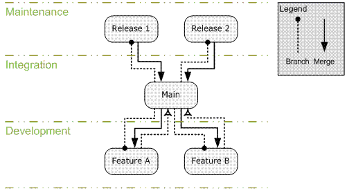
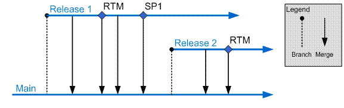
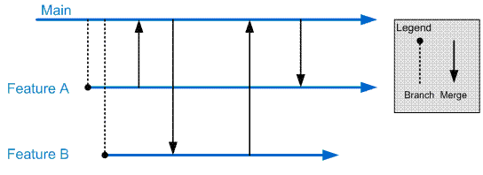

### Chapter 5 - Defining Your Branching and Merging Strategy 
- _[J.D. Meier](http://blogs.msdn.com/jmeier), [Jason Taylor](http://jtaylorgoodlife.blogspot.com/), Alex Mackman, [Prashant Bansode](http://prashantbansode.blogspot.com/), [Kevin Jones](http://blogs.advantaje.com/blog/kevin/)_

### Objectives
* Know when and when not to branch.
* Choose a branching and merging strategy for your project.
* Describe how normal branching strategy needs to be adapted to support very large teams.
* Identify appropriate folder structures for different branching scenarios.

### Overview
This chapter introduces branching and merging strategies for a range of common scenarios. Usually, you need branches to support either releases or parallel development.

For many simple scenarios, you do not need to branch and labeling your builds is sufficient. For example, by using labels you can re-create a build at any point in the future or find out which versions of a source file were used to create a particular build. You should consider branching if you need isolation for parallel teams, either to work on separate but overlapping features or to support a release. 

### How to Use This Chapter
Use this chapter to learn when and when not to branch. If you decide that branching is appropriate for your situation, use this chapter to learn how to branch and merge effectively. 

If you want an overview of branching and merging, then read the chapter from start to finish to learn about the different strategies for branching and the different scenarios where branching is appropriate. If you are interested in a particular scenario, go directly to the relevant section. To gain the greatest benefits from this chapter, you should:
* **Use the scenarios list**. Use the scenarios list to locate the scenario closest to your own. Read the recommendations to create a branched folder structure appropriate for your needs.
* **Use the companion guidance**. Refer to the**** branching and merging guidelines in “Source Control Guidelines” in this guide for a summary of branching and merging guidelines.

### Scenarios for Branching and Merging
The following are examples of scenarios where you might need to create branches and perform merges:
* If you are having regular problems with broken builds, you should create a development branch to isolate parallel development efforts.
* If you have features that are causing stability issues, or teams causing stability issues among each other, create separate feature or team branches beneath a development container folder in source control. 

Do not branch unless it becomes necessary for your development team. Branching introduces additional source tree maintenance and merging tasks. Most development teams such as those building line of business applications, working on short release cycles do not need to branch. Development teams working on longer release cycles such as Independent Software Vendors (ISVs) building packaged applications are more likely to need branching as part of the development process.

If you have one stream of development, or are performing incremental and continuous releases, you might not need to create branches unless you frequently experience breaking changes that are destabilizing your development efforts.

### Common Scenarios in Practice
The following are the most common branching scenarios:
* **Scenario 1 – No Branches.** Your team works only from the main source tree. In this case, you do not create branches and you do not need isolation. This scenario is generally for small or medium size teams that do not require isolation for teams or for features, and do not need the isolation for releases.
* **Scenario 2 – Branch for Release.** Your team creates branches to support an ongoing release. This is the next most common case where you need to create a branch to stabilize for a release. In this case, your team creates a branch before release time to stabilize the release and then merges changes from the release branch back into the main source tree after the software is released.
* **Scenario 3** – **Branch for Maintenance.** Your team creates a branch to maintain an old build.**** In this case, you create a branch for your maintenance efforts, so that you do not destabilize your current production builds. You may or may not merge changes from the maintenance branch back into the main tree. For example, you might work on a quick fix for a subset of customers that you do not want to include in the main build.
* **Scenario 4 – Branch for Feature.** Your team creates branches based on features. In this case, you create a development branch, perform work in the development branch, and then merge back into your main source tree. You can create separate branches for work on specific features to be completed in parallel.
* **Scenario 5 – Branch for Team**. You branch to isolate sub-teams so they can work without being subject to breaking changes, or can work in parallel towards unique milestones.

You may encounter one or more of these scenarios. Use these scenarios as a reference point to see what guidance may or may not apply to you.

### Example Folders and Their Purpose
The following folders are examples of folders you might create in Microsoft® Visual Studio® Team Foundation Server (TFS) source control when structuring your source tree for branching and merging scenarios.
* **Development** is branched from **Main** and used to isolate active development. Development branches may be temporary, in order to develop risky changes without impacting **Main**.
* **Main** contains your main source tree. Changes from other branches are integrated here.
* **Releases** contains branches you have already shipped but now need to maintain for customers. This provides isolation from the active development occurring in your development branch. It also contains a current release branch which is**** branched from **Main** and contains the version you are currently locking down prior to release. You work in this branch to prepare your software for release, while others continue to work in the **Development** branch working on new features.

The following sections show the use of branching in each of the preceding scenarios with concrete examples.

### Scenario 1 – No Branches
This scenario generally applies to smaller teams for whom isolated development is not a concern. By labeling builds, you are able to retrieve the source corresponding to a particular build. There is no need to introduce branching complexity because you can work directly from **Main** folder. The following is a view depicting the no-branch scenario:
{{
My Team Project
	Main
		Source
}}
### Scenario 2 – Branch for Release
In this scenario your team creates a branch to stabilize the release and then merges the release branch back into the main source tree after the software is released. The following is a view showing branching for releases:
{{
My Team Project
	Main 				? Main integration branch
		Source
	Releases
		Release 1 		? Release branch 
			Source
}}

### Scenario 3 – Branch for Maintenance
In this scenario, you create a branch for your maintenance efforts, so that you do not destabilize your current production builds. The following is a view showing maintenance branches. This is very similar to branch for release, however at this point the branch is maintained over time in order to support the release:
{{
My Team Project
	Main 					?Main integration branch
		Source
	Releases 				?Maintenance branch container
		Release 1 			?Maintenance branch
			Source	
			Other Asset Folders	
		Release 2 			? Maintenance branch
			Source
			Other Asset Folders	
}}
### Scenario 4 – Branch for Feature
In this scenario, you create a development branch, perform work in that branch, and then merge your work back into your main source tree. You organize your development branches based on product features. The following is a physical view showing branching for feature development:
{{
My Team Project
	Development 				? Isolated development branch container
		Feature A 			? Feature branch	
			Source
		Feature B 			? Feature branch
			Source
		Feature C 			? Feature branch
			Source
	Main 					? Main Integration branch
		Source
}}
### Scenario 5 – Branch for Team
This scenario is similar to the preceding branch-by-feature scenario, except that you organize your development branches according to sub-team rather than product feature. There might be a one-to-one correspondence between team and feature, but in some cases a team might work on multiple features. The following is a physical view showing branching for sub-team development:
{{
My Team Project
	Development 				? Isolated development branch container
		Team 1				? Team branch
			Feature A 		? Isolated branch for development
				Source
			Feature B 		? Isolated branch for development
				Source
		Team 2				? Team branch
			Feature A 		? Isolated branch for development
				Source
			Feature B 		? Isolated branch for development
				Source
	Main 					? Main Integration branch
		Source
}}
### Logical Structure
The logical structure consists of the parent/child relationships for each branch. This may be different from the physical structure you can see in the Source Control Explorer. For example, in the preceding physical structure, **Development** and **Main** appear to be peers, when **Development** is actually a child of **Main**. 

Figure 5.1 shows an example of a logical relationship and how branches and merges flow through the structure. 

  

**_Figure 5.1** Logical Relationship Showing Branch and Merge Flow_

### Release Scenario
Figure 5.2 shows a typical timeline when branching for a release:  
 
**_Figure 5.2** Branching for Release Timeline_

The sequence of events is as follows:
# The **Release 1** branch is created from **Main** once the release is ready to be locked down.
# Periodic merges into **Main** ensure bug fixes from the release are moved into the main integration branch.
# The release build is labeled in the **RTM** branch and merged back into **Main**.
# A service pack, SP1, is released. The build is labeled and changes are merged into **Main**.
# The **Release 1** branch lives on in support of SP1 and to enable future service packs.

This process repeats for future releases.

**Note:** Successful use of release branches requires you to identify which branch the fix should be applied to before implementing it. If you release a fix as a hotfix or service pack, you should make the change first on the appropriate **Release** branch, and then merge it into **Main** to ensure it gets applied to future releases.

### Isolated Development Scenario
Figure 5.3 shows a typical timeline when branching for development isolation.
 
**Figure 5.3 _**Branching for Development Isolation TimeLine_

The sequence of events is as follows:
# A feature branch is created to isolate development for Feature A.
# A feature branch is created to isolate development for Feature B.
# Each team merges its changes into **Main** as feature milestones are completed, so that they can be integrated into the main build and picked up by other teams.
# On a periodic schedule, each team merges the latest changes from **Main** in order to remain synchronized with the work of other teams and to reduce the number of conflicts per merge.
# When the feature is complete, the changes are fully merged back to **Main** and the feature branch is removed.

### Branching Considerations
When branching, consider the following:
* Do not branch unless your development team needs to work on the same set of files concurrently. If you are unsure about this, you can label a build and create a branch from that build at a later point. Merging branches can be time consuming and complex, especially if there are significant changes between them.
* Structure your branch trees so that you only need to merge along the hierarchy (up and down the branch tree) rather than across the hierarchy. Branching across the hierarchy requires that you use a baseless merge, which requires more manual conflict resolution.
* The branch hierarchy is based on the branch parent and branch child, which may be different than the physical structure of the source code on disk. When planning your merges, keep in mind the logical branch structure rather than the physical structure on disk.
* Do not branch too deeply. Because it takes time to execute each merge and resolve conflicts, a deep branching structure can mean that changes in a child branch may take a very long time to propagate to the main branch. This can negatively impact project schedules and increase the time to fix bugs.
* Branch at a high-level and include configuration and source files.
* Evolve your branching structure over time.
* Merging requires one or more developers to execute the merge and resolve conflicts. The merged source must be thoroughly tested because it is not uncommon to make bad merge decisions that can destabilize the build.
* Merging across the branch hierarchy is especially difficult and requires you to manually handle many conflicts that could otherwise be handled automatically.

The decision whether to create a branch can be reduced to whether the cost of merging conflicts in real time is higher than the overhead cost of merging conflicts between branches. 

### Large Project Considerations
Large development teams with long development cycles are likely to distinguish themselves from smaller teams in the following ways:
* They require a more complex branching and merging structure. 
* They are more likely to manage dependencies across solutions and team projects.
* They are more likely to maintain multiple builds for components and teams.

Large teams are likely to branch both by team and by feature and are also more likely to have one or more branches designed to integrate external dependencies. Because the branching structure is deeper there is more lag between a change in a development branch and merging that change into the main integration branch. For this reason, you should carefully consider your merging strategy when creating branches. 

For example, consider the following when determining whether your merges will be scheduled or event driven:   
* Reverse integration, such as merging from the development branch to the main branch, may be based on an event, such as a feature milestone being completed, or scheduled in order to integrate code from multiple branches at particular points in time.  Whether it is based on a milestone or scheduled often, it is driven by a combination of the phase of the software development cycle and the methodology used.
* Forward integration, such as merging from the main branch to a development branch, occurs when a child branch is ready to accept the latest code that has been integrated into a parent branch.  Frequent forward integrations into development branches are a best practice.  Keeping the code base more closely synchronized across branches will help you discover bugs that occur when components are integrated together.

Rationalize your branch/merge strategy with the frequency with which you want to produce builds. A deeper branching structure results in more time to merge from child branches to the main integration branch. Symptoms of this causing a problem for your development team include:
* Broken builds where the fix takes too long to propagate up to the main integration branch.
* Missed milestones because features take too long to propagate up to the main branch.
* Large amounts of time are spent merging changes between various branches.

If this becomes a problem for your team, consider reducing the depth of your branching structure. 

The following is an example of a complex branching structure:

* **My Team Project**
	* **Development** – Container to isolate active development branches
		* **Feature A** – Isolated branch for development
			* **Source**
		* **Feature B** – Isolated branch for development
			* **Source**
	* **Main** – Main integration and build branch. All changes come together here.
		* **Source**
		* **Other Asset Folders**
	* **Releases** – Container for current release and maintenance branches
		* **Release 2**– Active maintenance branch
			* **Source**
			* **Other Asset Folders**
		* **Release 3** – Active maintenance branch
			* **Source** 
			* **Other Asset Folders**
		* **Release 4 –** Branch containing the code currently being locked down to release
			* **Source** 
			* **Other Asset Folders**
	* **Safe Keeping**
		* **Release 1** – Old release in safe keeping
			* **Source**
			* **Other Asset Folders**

This structure includes:
* Feature branches for multiple teams to work in isolation.
* A main branch to gather changes by all teams as well as bug fixes from the release branches.
* A release branch used to lockdown the current release.
* A maintenance branch for an old release that is being actively maintained and supported.
* Safekeeping branches for older releases that are no longer being maintained.

### Summary
Branches are usually created to lock down a release, to maintain a previous release, or to support isolated parallel development. You should not branch unless you have good reason to do so.

When creating branches, you should logically structure your branch trees so that you only need to merge along the hierarchy (up and down the branch tree) rather than across the hierarchy. Merging across the hierarchy is time-consuming and error-prone.

For large teams, the branching structure is deeper, so you should be prepared for more lag time between a change occurring in a development branch and that change being merged back into the main integration branch.

### Additional Resources
* For an introduction to branching and merging, see “Branching and Merging Primer” at [http://msdn2.microsoft.com/en-us/library/aa730834(VS.80).aspx](http://msdn2.microsoft.com/en-us/library/aa730834(VS.80).aspx) 
* For more information about branching, see “How to: Branch Files and Folders” at [http://msdn2.microsoft.com/en-us/library/ms181425(VS.80).aspx](http://msdn2.microsoft.com/en-us/library/ms181425(VS.80).aspx)
* For more information about merging, see “How to: Merge Files and Folders” at [http://msdn2.microsoft.com/en-us/library/ms181428(VS.80).aspx](http://msdn2.microsoft.com/en-us/library/ms181428(VS.80).aspx)
* For additional descriptions of how to branch and merge in Visual Studio 2005, see “Branching and Merging Team Foundation Source Control” at [http://msdn2.microsoft.com/en-us/library/ms181423(VS.80).aspx](http://msdn2.microsoft.com/en-us/library/ms181423(VS.80).aspx)