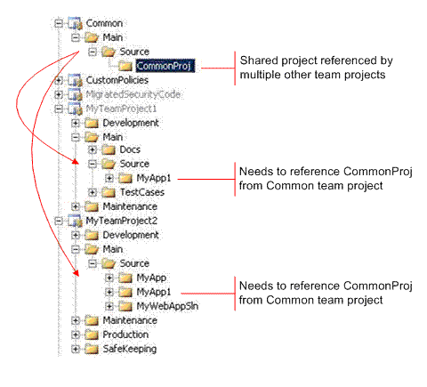
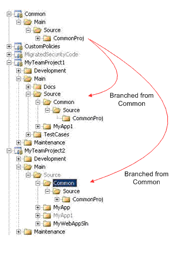
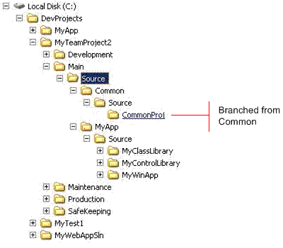
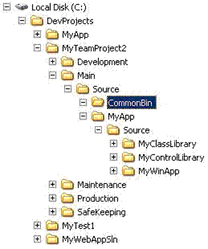
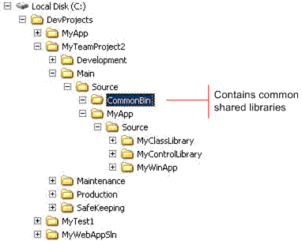

### Chapter 6 - Managing Source Control Dependencies in Visual Studio Team System
- _[J.D. Meier](http://blogs.msdn.com/jmeier), [Jason Taylor](http://jtaylorgoodlife.blogspot.com/), Alex Mackman, [Prashant Bansode](http://prashantbansode.blogspot.com/), [Kevin Jones](http://blogs.advantaje.com/blog/kevin/)_

### Objectives
* Manage source control dependencies in Microsoft® Visual Studio Team System.
* Reference projects and assemblies from different solutions in the same team project.
* Reference projects and assemblies from other team projects.
* Reference third-party assemblies.
* Manage Web service references in a team environment.
* Manage database references in a team environment.

### Overview
This chapter explains how you should handle source control dependencies both within and across Visual Studio solutions. A consistent approach to managing dependencies in a team environment is necessary in order to reduce build instability and ongoing source control maintenance costs. 

Dependencies include other projects, external assemblies, Web services, and databases. Dependencies inevitably change over time and as a result they impact the build process and the build order of your application. A good dependency management approach improves the integration process while making builds as seamless as possible.

### How to Use This Chapter
Use this chapter to learn about managing dependencies in a team environment. You can either read this chapter from start to finish or read the section that addresses your specific dependency management requirement. Use the “Scenarios and Solutions” section to understand the general dependency management scenarios in a team environment. This section serves as a jumping-off point to following sections that describe each dependency scenario in detail. 

* **Use the “Referencing Projects” section** to learn how to manage dependencies on other projects both inside and outside of your current team project.
* **Use the “Referencing Third-Party Assemblies” section** to learn how to manage dependencies on third-party assemblies for which you do not own the source.
* **Use the “Referencing Web Services” section** to learn how to reference shared Web services in a team environment.
* **Use the “Referencing Databases” section** to learn how to reference and connect to shared databases in a team environment.

### Scenarios and Solutions
The following scenarios are common when managing dependencies:
# You want to reference an assembly generated by another project in the same solution.
# You want to reference an assembly generated by another project in a separate solution.
# You want to reference an assembly contained in another team project.
# You want to reference a third-party assembly.

#### Referencing Assemblies Generated by another Project in the Same Solution
If you need to reference another assembly in the same Visual Studio solution, use a Visual Studio project reference. By using project references, you enable Visual Studio to do a few things automatically for you, such as keeping build configuration (debug/release) synchronized and tracking versioning and rebuilding of components as necessary when assembly versions change.

#### Referencing Assemblies Generated by Projects in a Separate Solution
If you need to reference an assembly generated by a project in a different Visual Studio solution, you have two choices:
* Use a file reference to point to the binary assembly.
* Add the Visual Studio project (project and source files) to your solution and then use a project reference.

File references are more fragile than project references, do not adhere to your build configuration, and are not tracked by Visual Studio build dependencies. Therefore, if the assemblies that you have referenced changes, the Visual Studio build system does not automatically know that a rebuild is required.

Alternatively you can branch the external project into your solution, build the binary and then use a project reference. The reference will be more robust, although you need to merge from the source branch regularly in order to pick up changes.

#### Referencing an Assembly from another Team Project
If you share source or binaries across team projects, you have two options:
* **Branching.** With this approach, you branch the source from the other team project into your current solution. This creates a configuration that unifies the source from the shared location and your project on the server-side.  
* **Workspace Mapping**. With this approach, you map the source from the other team project into a workspace on your development computer. This creates a configuration that unifies the source from the other team project and your project on the client-side. 

Branching is the preferred approach because it stores the dependency relationship on the source control server. Workspace mapping is a client-side-only approach, which means that you and every developer must create the mapping on your own computers and also on the build server in order to successfully build the application. 

Branching adds additional merge overhead but it enables you to make the decision to pick up updated binaries or source more explicitly.

#### Referencing a Third-Party Assembly
This scenario is very similar to referencing across team projects except that you only share binaries, not source code. The choice between branching and workspaces is very similar, with the added caveat that the overhead is likely to be lower because third-party assemblies are less likely to change as frequently.

### Referencing Projects
If you have a Visual Studio project, for example a team project containing shared library code that is used by multiple team projects, you can either manage the project within the owning team’s project or you can create a separate team project specifically for the shared project. 

If you choose the latter approach and use a common shared project, the folder structure in Microsoft Visual Studio Team Foundation Server (TFS) source control looks like Figure 6.1.
 

**_Figure 6.1** Using a Common, Shared Project Folder Structure_

To consume the common shared project from your own team project you have two options:
* **Branching** 
* **Workspace mapping** 

#### Branching 
Branching is the preferred method for most shared-source scenarios. It enables you to pull the shared source into your project and check it into your team project’s source control. In this scenario, you branch the source from the common shared location into your team project. This creates a configuration that unifies the source from the shared location and your project on the server-side. 

Shared source changes are picked up as part of a merge process between the branches. This makes the decision to pick up changes in the shared source more explicit and easier to test, but it also adds some overhead. Additionally, this process makes the use of Team Build much simpler because the mapping is done on the server side; there is no client-side mapping that needs to be duplicated on the build server.

For example, if you have two team projects named $TeamProject1 and $Common, and Common is the shared project source, you create a branch from the shared location to the project that references it. The TFS folder structure should resemble the one shown in Figure 6.2.
 
**_Figure 6.2** Using Branches_

Your workspace mapping should resemble the following:

||**Source Control Folder**	||**Local Folder** ||
||$/MyTeamProject1/Main/Source/	||C:\MyTeamProject\Main\Source||

The client side workspace folder structure should resemble the one shown in Figure 6.3.

 
**_Figure 6.3** Client Side Workspace Mapping_

#### Workspace Mapping 
If you want your developers to instantly pick up any code changes from the shared source without incurring the overhead of branching and merging, you can map the shared source from the common project into the workspace on your development computer. This creates a configuration that unifies the source from the shared location and your project on the client-side. 

The advantage of this approach is that shared project changes are picked up every time you retrieve the latest source into your workspace. However, this makes the use of Team Build more complex since the workspace mapping is a client-side construct.

For example if you have two team projects named $MyTeamProject and $Common, and Common is the shared project source, for referencing the code from the shared location, these projects share a common path on the client’s hard drive. The client side workspace folder structure should resemble the one shown in Figure 6.4.

 
**_Figure 6.4** Using Workspace Mapping_
The workspace mappings should resemble the following: 
||**Source Control Folder**	||**Local Folder** ||
||$/MyTeamProject2/Main/Source/	||C:\DevProjects\MyTeamProject2\Main\Source\||
||$/Common 	||C:\DevProjects\MyTeamProject2\Main\Source\Common||

For more information, see “Working with multiple team projects in Team Build” at [http://blogs.msdn.com/manishagarwal/archive/2005/12/22/506635.aspx](http://blogs.msdn.com/manishagarwal/archive/2005/12/22/506635.aspx) 

### Referencing Third-Party Assemblies
If you cannot use a project reference and you need to reference an assembly outside of your current solution's project set, such as a third-party library, and you do not want to or cannot create a branch from the originating project into your project, you must set a file reference. 

Managing shared binaries is similar to managing shared project source, and you must decide where you want to store the binaries and how you want your team to access the binaries. If you have binaries that are used by multiple team projects, you can either manage the binaries within the team project of the owning team or create a team project specifically for the shared binaries.

For the teams consuming the shared binaries, the same two options available for referencing projects are available for binaries.

* **Branching** 
* **Workspace Mapping** 

#### Branching 
In this scenario, you branch the binaries from the common shared location into your team project. This creates a configuration that unifies the binaries from the shared location and their project on the server-side. 

The difference is that any changes to the binaries, such as new versions are picked up as part of a merge process between the branches. This makes the decision to pick up changed shared binaries much more explicit. 

For example if you have two team projects named $TeamProject1 and $Common, and Common contains the shared binaries, you create a branch from the shared location to the project that references it. The TFS folder structure should resemble the one shown in Figure 6.5.

**_Figure 6.5** Branching from Common_

Your workspace mapping should resemble the following:

||**Source Control Folder**	||**Local Folder** ||
||$/MyTeamProject1/Main	||C:\MyTeamProject1\Main||

The client side workspace folder structure should resemble the one shown in Figure 6.6. 

 
**_Figure 6.6** Client-Side Workspace Folder Structure_

#### Workspace Mapping 
In your team project that consumes the shared binaries, you reference the binaries from the shared location into your workspace on your development computer. This creates a configuration that unifies the binaries from the shared location and your project on the client-side. 

The advantage of this approach is that changes to shared binaries are picked up every time you retrieve the latest source into your workspace.

For example if you have two team projects named $TeamProject1and $Common, and TeamProject1 references the binaries available in Common, then the client side workspace folder structure should resemble the one shown in Figure 6.7.

**_Figure 6.7** Storing Common Shared Libraries_
The workspace mappings should resemble the following: 
||**Source Control Folder**	||**Local Folder** ||
||$/MyTeamProject2/Main/	||C:\DevProjects\MyTeamProject2\Main\||
||$/Common/Main/Bin	||C:\DevProjects\MyTeamProject2\Main\Source\CommonBin||

For more information, see “Working with multiple team projects in Team Build” at [http://blogs.msdn.com/manishagarwal/archive/2005/12/22/506635.aspx](http://blogs.msdn.com/manishagarwal/archive/2005/12/22/506635.aspx)

### Guidelines for Referencing Projects and Assemblies
You can set a file reference in one of two ways: 
* To reference a .NET Framework assembly, you select the assembly from the list displayed on the .**NET** tab of the **Add References** dialog box. 
* You can use the **Browse** button in the **Add Reference** dialog box. 
  
Assemblies such as System.XML.dll are located in the Global Assembly Cache (GAC). However, you never directly refer to an assembly within the GAC. Instead, when you select an assembly on the .**NET** tab of the **Add** **References** dialog box, you actually reference a copy of the assembly, located within the %windir%\Microsoft.NET\Framework\<version>\ folder.

Project references are preferable to file references. Keep the following guidelines in mind when managing assembly references:
* Use project references whenever possible.
* Use file references only where necessary.
* Use **Copy Local = True** for project and file references.

For more information, see “Source Control Guidelines” in this guide.

#### Automated Dependency Tracking
Each time you build your local project, the build system compares the date and time of the referenced assembly file with the working copy on your development workstation. If the referenced assembly is more recent, the new version is copied to the local folder. One of the benefits of this approach is that a project reference established by a developer does not lock the assembly dynamic-link library (DLL) on the server and does not interfere in any way with the build process.

### Referencing Web Services
In simpler systems where all of the projects for the system are contained within the same team project, all developers end up with local working copies of all Web services because they are defined by Visual Studio projects within the team project. When you open a solution from source control for the first time, all projects (including any Web services) are installed locally. Similarly, if a Web service is added to the solution by another developer, you install the Web service the next time you refresh your solution from source control. In this scenario, there is no need to publish Web services on a central Web server within your team environment.

For larger systems, Web services can be published through Internet Information Server (IIS) on a centrally accessed Web server and not all developers need to locally install the Web service. Instead developers can access the Web service from their client projects, although you need to reference the Web service appropriately as discussed below. 

For more information, see “Source Control Guidelines” and “Source Control Practices” in this guide.

#### Use Dynamic URLs When Referencing Web Services
If you want to call a Web service, you must first add a Web reference to your project. This generates a proxy class through which you interact with the Web service. The proxy code initially contains a static Uniform Resource Locator (URL) for the Web service, for example http://localhost or http://SomeWebServer.

**Important:**  For Web services in your current solution that execute on your computer, always use http://localhost rather than http://MyComputerName to ensure the reference remains valid on all computers.

The static URL that is embedded within the proxy is usually not the URL that you require in either the production or test environment. Typically, the required URL varies as your application moves from development to test to production. You have three options to address this issue: 
* You can programmatically set the Web service URL when you create an instance of the proxy class. 
* A more flexible approach that avoids a hard coded URL in the proxy is to set the **URL Behavior** property of the Web service reference to **Dynamic**. This is the preferred approach. When you set the property to **Dynamic**, code is added to the proxy class to retrieve the Web service URL from a custom configuration section of the application configuration file, Web.config for a Web application or SomeApp.exe.config for a Windows application. 
* You can also generate the proxy by using the WSDL.exe command line tool and specifying the /urlkey switch. This works in a similar way to setting the **URL Behavior** property in that it adds code to the proxy to retrieve the Web service URL, but in this case the URL is stored in the <applicationSettings> section of the application configuration file.

The dynamic URL approach also lets you provide a user configuration file, which can override the main application configuration file. This enables separate developers and members of the test team to temporarily redirect a Web service reference to an alternate location.

#### How to Use Dynamic URLs and a User Configuration File
Set the **URL Behavior** property of your Web service reference to **Dynamic** to gain maximum configuration flexibility within both the development and production environments. By default, Visual Studio sets the value of this property to **Dynamic** when you add a Web reference. To check that this value is still set to **Dynamic**:
# In the Solution Explorer, expand the list of Web references. 
# Select each Web reference in the list.
# For each Web reference, check that the value of the **URL Behavior** property is set to **Dynamic**.

**To specify a Web Service URL in a user configuration file**
* When you first add a Web reference, Visual Studio automatically generates the App.config file for you. This file contains the Web service reference and the configuration setting in the App.config file looks like the following:
{{
<configuration>
    <configSections>
        <sectionGroup name="applicationSettings" type=
                 "System.Configuration.ApplicationSettingsGroup, System, Version=2.0.0.0, Culture=neutral,
                            PublicKeyToken=b77a5c561934e089" >
            <section name=" YourProject.Properties.Settings" type=
                    "System.Configuration.ClientSettingsSection, System, Version=2.0.0.0, Culture=neutral,
                                    PublicKeyToken=b77a5c561934e089" requirePermission="false" />
        </sectionGroup>
    </configSections>
    <applicationSettings>
        <YourProject.Properties.Settings>
            <setting name="SomeService_ localhost _Service" serializeAs="String">
                <value>http://localhost/someservice/Service.asmx</value>
            </setting>
        </ YourProject.Properties.Settings>
    </applicationSettings>
</configuration>
}}
This file contains a new configuration section that is used by the generated proxy. This configuration section contains the address of the Web service that Visual Studio found when generating this proxy. 

Visual Studio also places the default value of the URL into the code generated for this proxy. This value lives in a file named Settings.Designer.cs. To see this file, 

* In the **Solution Explorer**, right-click on the Web service. 
* Select **View in Object Browser**. In the Object Browser look for the entry that says **YourProject.Properties** entry, where YourProject is the project name that contains Web service reference. 
* Expand **YourProject.Properties** and you then double-click **Settings.** This opens the Settings.Designer.cs file that contains a line similar to the following:

{{ [global::System.Configuration.DefaultSettingValueAttribute("http://localhost:/webservice/Service.asmx")](global__System.Configuration.DefaultSettingValueAttribute(_http___localhost__webservice_Service.asmx_)) }}

This is the default value used for the URL of the Web service if no configuration information is found.

You often need to change the URL of the Web service you are calling. For example you might want to test against the Web service running locally on your computer or against a version of the Web service running in a test environment. It is also highly likely that the URL of the production Web service is not the same as the URL used during development. To manage each of these URLs the URL value should be specified in a user configuration file, which is referenced from the main App.config file. The name of the user configuration file is arbitrary. The following example uses User.config as the file name to make clear that this is where the user’s configuration would go. 

**To create a User.config file perform the following steps**
* In Solution Explorer, right-click the project that contains the Web service reference, point to **Add** and then click **New Item**.
* Select **Application Configuration File**, change the name to User.config and then click **Add**.
* Copy the _<YourProject.Properties.Settings>_ element setting from your application configuration file (App.config) to the User.config file. This file should contain only the element for which the runtime is redirected. Delete the <?xml> directive and the <configuration> element if present, as shown in the following example
{{
<YourProject.Properties.Settings>
    <setting name="SomeService_localhost_Service" serializeAs="String">
       <value>http://localhost/someservice/Service.asmx</value>
    </setting>
</YourProject.Properties.Settings>
}}

Individual developers should set the contents of their User.config file as needed to reference the appropriate URL. You now need to specify that the configuration system should use this User.config file for this configuration data rather than the App.config file. To do this you must update the App.config file as follows:
* Add a **configSource**=**"user.config"** attribute to the _<YourProject.Properties.Settings_> element of your main application configuration file. This silently redirects the runtime to the named user configuration file when it accesses information from this section.  
* Delete the content of the _<YourProject.Properties.Settings>_ element. 

Your App.config should now look like the following:
{{
<?xml version="1.0" encoding="utf-8" ?>
<configuration>
    <configSections>
        <sectionGroup name="applicationSettings" type=
                "System.Configuration.ApplicationSettingsGroup, System, Version=2.0.0.0, Culture=neutral,
                          PublicKeyToken=b77a5c561934e089" >
            <section name="YourProject.Properties.Settings" type=
                     "System.Configuration.ClientSettingsSection, System, Version=2.0.0.0, Culture=neutral,
                                 PublicKeyToken=b77a5c561934e089" requirePermission="false" />
        </sectionGroup>
    </configSections>
  <applicationSettings>
    <yourProject.Properties.Settings  configSource="user.config">
    </YourProject.Properties.Settings>
   </applicationSettings>
</configuration>
}}
In the preceding example, _YourProject_ is the name of the project that contains the Web service reference. 

**Important:** If you use the **configSource** attribute, then the user configuration file must be present, with only the _<YourProject.Properties.Service>_ element. You must also ensure that when you add the **configSource=”user.config”** attribute you remove the Extensible Markup Language (XML) content from the _<YourProject.Properties.Service>_ element.

When you use the User.config approach:
* Make sure that you deploy your User.config file along with the application code. To do this in Solution Explorer, right click the User.config file, click **Properties** option and then set the **Copy To Output Directory** property to **Copy if newer**.
* Do not add your User.config file to source control. In this way, each developer and the test team can explicitly bind to specific URLs by using their own User.config files. Source control may contain other User.config files, for example, for testing and for production. These files should be managed by the users responsible for managing the testing and production environments. These test and production User.config files should not be stored as part of the Web service projects but should be in different areas of the source control system.
* Store a global User.config file in source control. This could either contain only the root element (no <setting> element) or it could specify the default location of the Web service. The User.config file must be present for the configuration system to work.
 
**Tip**: By default, the user configuration file is automatically added to source control when you add the solution. To prevent this, when you first check in the file, clear the User.config file check box. You can then right-click on the file in Solution Explorer and select the **Undo Pending Changes** option to ensure that the file is subject to source control.

**Important:** If the User.config file that specifies the URL only contains the root element and there is no setting element in the User.config, then the Web service proxy uses its default value for the URL. This default value is hard coded into the proxy in a file named Settings.Designer.cs. The value is specified as a **DefaultValueSettings** attribute and looks like the following

{{ [global::System.Configuration.DefaultSettingValueAttribute("http://localhost/webservice/Service.asmx")](global__System.Configuration.DefaultSettingValueAttribute(_http___localhost_webservice_Service.asmx_)) }}

**Important:**  For Web applications that use a user configuration file, any changes made to the file result in the Web application being automatically recycled by default. If you do not want to recycle the application when a value changes, add the **restartOnExternalChanges**="**false**" attribute to the configuration section definition as follows:
{{
<configSections>
	<sectionGroup name="applicationSettings" type=
              "System.Configuration.ApplicationSettingsGroup, System, Version=2.0.0.0, Culture=neutral,
                         PublicKeyToken=b77a5c561934e089">
		<section name="Test.Properties.Settings" type=
                      "System.Configuration.ClientSettingsSection, System, Version=2.0.0.0, Culture=neutral, 
                             PublicKeyToken=b77a5c561934e089" requirePermission="false" restartOnExternalChanges="true"/>
	</sectionGroup>
</configSections>
}}

If you add this attribute to the configuration section in the Web.config file then changes to the external User.config configuration file do not cause the Web application to recycle. However, those changes are still visible to the application.

It is important to understand that if you are using this mechanism then the User.config file must be present. Somebody must be responsible for ensuring the environment is correct when creating builds for production releases and for any test environments. As part of this build setup, the appropriate User.confg file must be retrieved from the source control system and copied into the correct location for MSBuild to be able to find it.

### Referencing Databases
Database references in the form of connection strings can also be managed by using an external configuration file. The advantage of this approach is that each developer can easily specify his or her own connection string in their own private User.config file. Any changes made by one developer, such as redirecting the connection to a local database for unit testing purposes, do not affect other developers. 

User configuration files can also be used to control environment-specific settings, such as those required by a test environment. The test environment can also use a User.config file that references the test database.

The procedure is similar to the preceding Web references example, except that in that example the Web service proxy contains the code to retrieve the Web service URL from the configuration file. For database connection strings, you must provide the code to read the connection string.

#### How to Use User Configuration Files for Database Connection Strings
The following procedure explains how to store and then reference a database connection string within a user configuration file.

To use a user configuration file to store database connection strings:

* Add a **configSource="user.config"** attribute to the <connectionStrings> element of your main application configuration file. 
{{
<configuration>
   <connectionStrings configSource=”user.config”/>
 </configuration>
}}
* To override the main application configuration file, create a User.config file (located in the same folder as the application configuration file), and then add a similar <connectionStrings> entry to the file. Notice that the following connection string references a local database. 
{{
<connectionStrings>
      <add name="DBConnStr"
     connectionString="server=localhost;Integrated Security=SSPI;database=Accounts"/>
   </connectionStrings>
</configuration>
}}
* Within your project, use the following code to obtain the connection string from the user configuration file. This code uses the static **ConnectionStrings** property of the **System.Configuration.ConfigurationManager class.** In the WinForm application, you must add a reference to **System.Configuration.dll** explicitly. 
{{
using System.Configuration;
private string GetDBaseConnectionString()
{
  return ConfigurationManager.ConnectionStrings["DBConnStr"](_DBConnStr_).ConnectionString;
}
}}
* Ensure that the User.config file is deployed along with the application code. To do so in Solution Explorer right click the User.config file, click the **Properties** and then**** in the Properties pane, set the **Copy To Output Directory** property to **Copy if newer**.
	
Do not add the User.config file to source control. In this way, each developer and the test team can explicitly specify the connection string through their own User.config file. Source control may contain other User.config files, for example for testing and for production. These files should be managed by the users responsible for managing the testing and production environments. These test and production User.config files should not be stored as part of the database projects but should be in different areas of the source control system.

In source control you should have a User.config file for each of the environments that you use, such as production and test. These configuration files should specify the connection string for the database. The User.config file must be present for the configuration system to work.
 
**Tip:** By default, the user configuration file is automatically added to source control when you add the solution. To prevent this, when you first check in the files, clear the User.config file check box. You can then right-click on the file in Solution Explorer and select **Undo Pending Changes** to ensure that the file never comes under source control.

It is important to understand that if you are using this mechanism, the User.config file must be present. Somebody needs to be responsible for ensuring the environment is correct when creating builds for production releases and for any test environments. As part of this build setup, the appropriate User.confg file will need to be retrieved from the source control system and copied into the correct location for MSBuild to be able to find it.

### Summary
When managing projects or third-party assemblies, you can use either branching or workspace mapping. Branching is the preferred approach because it stores the dependency relationship on the source control server. Using branches enables you to make a conscious decision to pick up updated binaries or source.

Workspace mapping is a client-side-only approach, which means each team member needs to create the mapping on their own computer as well as on the build server in order to be able to build the application. This approach is most commonly used when you want to instantly pick up updated binaries or source at the time of your build.

Use dynamic URLs when referencing Web services and use an external configuration file to manage Web services. The advantage of this approach is that each developer can easily specify his or her own Web services reference in a private User.config file. You can also manage database references in the form of connection strings by using an external configuration file. The advantage of this approach is that each developer can easily specify his or her own connection string in a private User.config file.

### Additional Resources
* For more information about project references, see “Project References” at [http://msdn2.microsoft.com/en-us/library/ez524kew(VS.80).aspx](http://msdn2.microsoft.com/en-us/library/ez524kew(VS.80).aspx) 
* For more information about branching, see “How to: Branch Files and Folders” at [http://msdn2.microsoft.com/en-us/library/ms181425(VS.80).aspx](http://msdn2.microsoft.com/en-us/library/ms181425(VS.80).aspx) 
* For more information about workspaces, see “Working with Source Control Workspaces” at  [http://msdn2.microsoft.com/en-us/library/ms181383(VS.80).aspx](http://msdn2.microsoft.com/en-us/library/ms181383(VS.80).aspx)