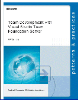

## patterns & practices Team Development with TFS Guide (Final Release)
Welcome to the **patterns & practices Team Development with Visual Studio Team Foundation Server** project site! This guide shows you how to make the most of Team Foundation Server.  It starts with the end in mind, but shows you how to incrementally adopt TFS for your organization.  It's a collaborative effort between patterns & practices, Team System team members, and industry experts.   This guide is related to our [Visual Studio Team System Guidance Project](http://www.codeplex.com/VSTSGuidance).  

- _[J.D. Meier](http://SourcesOfInsight.com), [Jason Taylor](http://jtaylorgoodlife.blogspot.com/), Alex Mackman, [Prashant Bansode](http://prashantbansode.blogspot.com/), [Kevin Jones](http://blogs.advantaje.com/blog/kevin/)_

### Download the Guide
Final release is available!  Start using the guide today, while we continue to make improvements.
* [Download the Team Development with Visual Studio Team Foundation Server Guide](http://www.codeplex.com/TFSGuide/Release/ProjectReleases.aspx?ReleaseId=6280)

### Download the Diagrams
Download the Visio diagrams we used in the guide so that you can modify them and use them to document your own particular environment.
* [Download the Team Foundation Server Guide Visio Diagrams](http://www.codeplex.com/TFSGuide/Release/ProjectReleases.aspx?ReleaseId=6919)

### Parts
Part I, Fundamentals
Part II, Source Control
Part III, Builds
Part IV, Large Project Considerations
Part V, Project Management
Part VI, Process Templates
Part VII, Reporting
Part VIII, Setting Up and Maintaining the Team Environment
Part IX, Visual Studio Team System 2008 Team Foundation Server
### Forewards
* [Foreword By Jeff Beehler](Foreword-By-Jeff-Beehler)
* [Foreword By Rob Caron](Foreword-By-Rob-Caron)
* [Foreword By Brian Harry](Foreword-By-Brian-Harry) 
### Chapters
* [Introduction](Introduction)
#### Part I, Fundamentals
* [Chapter 1 - Introducing the Team Environment](Chapter-1---Introducing-the-Team-Environment)
* [Chapter 2 - Team Foundation Server Architecture](Chapter-2---Team-Foundation-Server-Architecture)
#### Part II, Source Control
* [Chapter 3 - Structuring Projects and Solutions in Source Control](Chapter-3---Structuring-Projects-and-Solutions-in-Source-Control)
* [Chapter 4 - Structuring Projects and Solutions in Team Foundation Source Control](Chapter-4---Structuring-Projects-and-Solutions-in-Team-Foundation-Source-Control)
* [Chapter 5 - Defining Your Branching and Merging Strategy](Chapter-5---Defining-Your-Branching-and-Merging-Strategy)
* [Chapter 6 - Managing Source Control Dependencies in Visual Studio Team System](Chapter-6---Managing-Source-Control-Dependencies-in-Visual-Studio-Team-System)
#### Part III, Builds
* [Chapter 7 - Team Build Explained](Chapter-7---Team-Build-Explained)
* [Chapter 8 - Setting Up Continuous Integration with Team Build](Chapter-8---Setting-Up-Continuous-Integration-with-Team-Build)
* [Chapter 9 - Setting Up Scheduled Builds with Team Build](Chapter-9---Setting-Up-Scheduled-Builds-with-Team-Build)
#### Part IV, Large Project Considerations
* [Chapter 10 - Large Project Considerations](Chapter-10---Large-Project-Considerations)
#### Part V, Project Management
* [Chapter 11 - Project Management Explained](Chapter-11---Project-Management-Explained)
* [Chapter 12 - Work Items Explained](Chapter-12---Work-Items-Explained)
#### Part VI, Process Templates
* [Chapter 13 - Process Templates Explained](Chapter-13---Process-Templates-Explained)
* [Chapter 14 - MSF for Agile Software Development Projects](Chapter-14---MSF-for-Agile-Software-Development-Projects)
#### Part VII, Reporting
* [Chapter 15 - Reporting Explained](Chapter-15---Reporting-Explained)
#### Part VIII, Setting Up and Maintaining the Team Environment
* [Chapter 16 - Team Foundation Server Deployment](Chapter-16---Installation-and-Deployment)
* [Chapter 17 - Providing Internet Access to Team Foundation Server](Chapter-17---Providing-Internet-Access-to-Team-Foundation-Server)
#### Part IX, Visual Studio Team System 2008 Team Foundation Server
* [Chapter 18 - What's New in Visual Studio Team System 2008 Team Foundation Server ](Chapter-18---What’s-New-in-Team-Foundation-Server-2008)

**Guidelines**
* [Guidelines:  Team Build ](Guidelines_--Build)
* [Guidelines:  Source Control](Guidelines_--Source-Control)
* [Guidelines:  Reporting](Guidelines_--Reporting)
* [Guidelines:  Project Management](Guidelines_--Project-Management)

**Practices**
* [Practices at a Glance:  Team Build ](Practices-at-a-Glance_---Build)
* [Practices at a Glance:   Source Control](Practices-at-a-Glance_---Source-Control)
* [Practices at a Glance:   Reporting](Practices-at-a-Glance_---Reporting)
* [Practices at a Glance:   Project Management](Practices-at-a-Glance_---Project-Management)

**Questions and Answers**
* [Questions and Answers:  Source Control](Questions-and-Answers_--Source-Control)

**How Tos**
* [How To - Add a New Developer To Your Project in Visual Studio Team Foundation Server](How-To---Add-a-New-Developer-To-Your-Project-in-Visual-Studio-Team-Foundation-Server)
* [How To - Automatically Run Code Analysis with Team Build in Visual Studio Team Foundation Server](How-To---Automatically-Run-Code-Analysis-with-Team-Build-in-Visual-Studio-Team-Foundation-Server)
* [How To - Create a Custom Report for Visual Studio Team Foundation Server](How-To---Create-a-Custom-Report-for-Visual-Studio-Team-Foundation-Server)
* [How To - Create a Risk Over Time Report for Visual Studio Team Foundation Server](How-To---Create-a-Risk-Over-Time-Report-for-Visual-Studio-Team-Foundation-Server)
* [How To - Create Custom Check-in Policies in Visual Studio Team Foundation Server](How-To---Create-Custom-Check-in-Policies-in-Visual-Studio-Team-Foundation-Server)
* [How To - Create Your Source Tree in Visual Studio Team Foundation Server](How-To---Create-Your-Source-Tree-in-Visual-Studio-Team-Foundation-Server)
* [How To - Customize a Process Template in Visual Studio Team Foundation Server](How-To---Customize-a-Process-Template-in-Visual-Studio-Team-Foundation-Server)
* [How To - Customize a Report in Visual Studio Team Foundation Server](How-To---Customize-a-Report-in-Visual-Studio-Team-Foundation-Server)
* [How To - Manage Projects in Visual Studio Team Foundation Server](How-To---Manage-Projects-in-Visual-Studio-Team-Foundation-Server)
* [How To - Migrate Source Code to Team Foundation Server from Visual Source Safe](How-To---Migrate-Source-Code-to-Team-Foundation-Server-from-Visual-Source-Safe)
* [How To - Perform a Baseless Merge in Visual Studio Team Foundation Server](How-To---Perform-a-Baseless-Merge-in-Visual-Studio-Team-Foundation-Server)
* [How To - Set Up a Continuous Integration Build in Visual Studio Team Foundation Server](How-To---Set-Up-a-Continuous-Integration-Build-in-Visual-Studio-Team-Foundation-Server)
* [How To - Set Up a Scheduled Build in Visual Studio Team Foundation Server](How-To---Set-Up-a-Scheduled-Build-in-Visual-Studio-Team-Foundation-Server)
* [How To - Structure ASP.NET Applications in Visual Studio Team Foundation Server](How-To---Structure-ASP.NET-Applications-in-Visual-Studio-Team-Foundation-Server)
* [How To - Structure Windows Applications in Visual Studio Team Foundation Server](How-To---Structure-Windows-Applications-in-Visual-Studio-Team-Foundation-Server)
* [How To - Structure Your Source Control Folders in Visual Studio Team Foundation Server](How-To---Structure-Your-Source-Control-Folders-in-Visual-Studio-Team-Foundation-Server)

**Resources**
* [Team Foundation Server Resources](Team-Foundation-Server-Resources)

### Team
* Core Team: [J.D. Meier](http://blogs.msdn.com/jmeier), [Jason Taylor](http://jtaylorgoodlife.blogspot.com/), Alex Mackman, [Prashant Bansode](http://prashantbansode.blogspot.com/), [Kevin Jones](http://blogs.advantaje.com/blog/kevin/)
* [Contributors and Reviewers](Contributors)

### Feedback
* Send mail to [TFSGuide@microsoft.com](mailto:TFSGuide@microsoft.com)
* Post comments on the Discussions page.

### Community
* [patterns & practices Community Wiki for Team System](http://www.CodePlex.com/TeamSystemCommunity)
* [Guidance Share](http://www.GuidanceShare.com)
* [Shaping Software](http://ShapingSoftware.com)