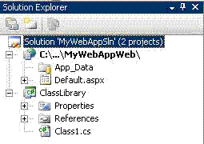
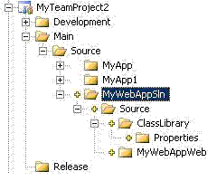

### How To: Structure ASP.NET Applications in Visual Studio Team Foundation Server
- _[J.D. Meier](http://blogs.msdn.com/jmeier), [Jason Taylor](http://jtaylorgoodlife.blogspot.com/), Alex Mackman, [Prashant Bansode](http://prashantbansode.blogspot.com/), [Kevin Jones](http://blogs.advantaje.com/blog/kevin/)_

### Applies To
* Microsoft® Visual Studio® 2005 Team Foundation Server (TFS)
* Microsoft Visual Studio Team System (VSTS)
* ASP.NET applications

### Summary
This How To article walks you through the process of organizing and structuring your ASP.NET Web applications for Team Foundation Server. This article explains an appropriate source tree structure to use within TFS source control. 

### Contents
* Objectives
* Overview
* Summary of Steps
* Step 1 – Create Local Folders for Your Web Project
* Step 2 – Create a Blank Solution
* Step 3 – Add a Web Site to Your Solution
* Step 4 – Add a Class Library (Optional)
* Step 5 – Check Your Solution Structure
* Step 6 – Check Your Local Folder Structure
* Step 7 – Add Your Solution to Source Control
* Shared Code Considerations
* Additional Resources

### Objectives
* Learn how to structure an ASP.NET application in TFS source control.
* Learn about an appropriate tree structure to use in TFS source control.

### Overview
This How To article shows you how to build a source control folder structure that is appropriate for ASP.NET Web applications. Because ASP.NET Web projects often include additional class libraries, a structure is required to accommodate these as well. Folders in which to maintain your ASP.NET Web projects are located beneath a **/Main/Source** top-level structure in source control. This structure enables you to easily use additional **Development** and **Releases** folders if you need to create branches for isolated development and for release maintenance. For more information about creating this top-level folder structure, see “How To: Structure Your Source Control Folders in Visual Studio Team Foundation Server”

### Summary of Steps
* Step 1 – Create Local Folders for Your Web Project
* Step 2 – Create a Blank Solution
* Step 3 – Add a Web Site to Your Solution
* Step 4 – Add a Class Library (Optional)
* Step 5 – Check Your Solution Structure
* Step 6 – Check Your Local Folder Structure
* Step 7 – Add Your Solution to Source Control

### Step 1 – Create Local Folders for Your Web Project
In this step, you create an appropriate local folder structure for your Web project on your development computer. To ensure a consistent approach for your team development, and to keep team projects well organized on your development computer, you should keep your entire development source from all of the team projects you are working on grouped together beneath a single root folder such as C:\DevProjects.

Create a top level folder such as C:\DevProjects.

### Step 2 – Create a Blank Solution
To create an ASP.NET Web Application, start by explicitly creating a Visual Studio Solution (.sln) file and then add your Web site and any supplementary projects you might need, such as class libraries. In the following steps, you create your solutions beneath a top level C:\DevProjects folder

# On the **File** menu, point to **New** and then click** Project**.
# Expand **Other Project Types** and select **Visual Studio Solutions**.
# Select **Blank Solution**.
# Name your solution **MyWebAppSln**.
# Set the **Location** to C:\DevProjects and then click **OK**.

This creates a C:\DevProjects\MyWebAppSln folder. Visual Studio adds the solution (.sln) file and solution user options (.suo) file to this folder. Note that only the .sln file is subsequently added to source control in Step 7.

### Step 3 – Add a Web Site to Your Solution
In this step, you add an ASP.NET Web site to your solution. The way you do this varies slightly depending on whether you are creating a new file system–based Web site that uses the Visual Studio development Web server or a Hyper Text Transfer Protocol (HTTP) Web site that uses Internet Information Services (IIS).

#### File System
To add a file system–based Web project to your solution:

# In **Solution Explorer**, right-click **Solution MyWebAppSln**, point to **Add,** and then click **New Web Site**.
# In the **Add New Web Site** dialog box, leave the **Location** as **File System**, and the **Language** as **Visual C#**.
# Set the **Location** directory to C:\DevProjects\MyWebAppSln\Source\MyWebAppWeb.
# Click **OK** to close the **Add New Web Site** dialog box.

Note that the “Web” suffix is used in this example to clearly denote the folder as a Web site root folder.

#### HTTP
To create an HTTP-based ASP.NET Web site that uses IIS, start by explicitly creating your virtual directory so that your Web site directory ends up in your defined location rather than beneath \inetpub\wwwroot.

**To create your Web site’s virtual directory**:
# Use Windows Explorer to browse to C:\DevProjects\MyWebAppSln\Source.
# Create a new folder beneath this location named **MyWebAppWeb**.
# Right-click **MyWebAppWeb** and then click **Sharing and Security**.
# Click the **Web Sharing** tab.
# Click **Share this folder**.
# Leave the **Alias** as **MyWebAppWeb**, leave the default **Access permissions** and **Application permissions,** and then click **OK**.
# Click **OK** twice.

**To add your Web site to your solution**:
# In **Solution Explorer**, right-click **Solution MyWebAppSln**, point to **Add,** and then click **New Web Site**.
# In the **Add New Web Site** dialog box, set the **Location** to **HTTP** and leave the **Language** as **Visual C#**.
# Set the **Location** URL to http://localhost/MyWebAppWeb.
# Click **OK** to close the **Add New Web Site** dialog box.

Visual Studio adds your Default.aspx, Default.aspx.cs files to the C:\DevProjects\MyWebAppSln\Source\MyWebAppWeb folder and creates **Bin** and **App_Data** child folders.

### Step 4 – Add a Class Library (Optional)
If your Web application requires additional class libraries, add them as follows:

# In **Solution Explorer**, right-click your **MyWebAppSln** solution, point to** Add,** and then click **New Project**.
# Select **Visual C#** as the project type and **Class Library** as the template.
# Type the name **ClassLibrary**, set the **Location** to C:\DevProjects\MyWebAppSln\Source, and then click **OK**. 

All new projects are added beneath the **Source** folder.

### Step 5 – Check Your Solution Structure 
Use Solution Explorer to verify your solution structure. It should resemble the following:

 
### Step 6 – Check your Local Folder Structure 
Use Windows Explorer to verify your local folder structure. It should resemble the following:
[Image:ASP.NET1.gif)(Image_ASP.NET1.gif)
 
### Step 7 – Add Your Solution to Source Control
In this step, you add your solution to TFS source control.

# Right-click your solution and then click **Add Solution to Source Control**.
# In the **Add Solution MyWebAppSln to Source Control** dialog box, select your team project 
# In the dialog box, click **Make New Folder**, and then name the new folder **Main** 
# Select the newly created **Main** folder and then click **Make New Folder**, name the new folder **Source** 
# Select the newly created **Source** folder and then click **OK**.
# Check your source control folder structure by clicking **Source Control** within **Team Explorer**. It should resemble the following:

# At this point you can view** pending** changes and check your solution source files into the server. To do so, on the **View Menu**, point to **Other Windows** and then click **Pending Changes**. Select your project and the source files to be checked-in, supply a check-in comment and then click **Check In**.

### Shared Code Considerations
For ASP.NET Web applications that reference shared source code, you can consider the following two main options:

* **Reference the code from a shared location**
* **Branch the shared code**

#### Reference the Code from a Shared Location
With this approach, you map the source from a shared location such as another team project into the workspace on your development computer. This creates a configuration that unifies the shared source from the shared location and your project code on your development computer. 

The advantage of this approach is that any changes to the shared source are picked up every time you retrieve the latest version of the source into your workspace. For example consider a team project named Common that contains the shared source. To reference the code from this location, you would map both team projects to a common path location on your development computer. For example: 
* C:\DevProjects\MyWebAppSln\ 
* C:\DevProjects\SharedCommon\  
The following workspace mappings are used: 
||**Source Control Folder**	||**Local Folder** ||
||$/MyTeamProject1/Main/Source/MyWebAppApp	||C:\DevProjects\MyWebAppSln||
||$/MyTeamProject2/Main/Source/Common	||C:\DevProjects\Common||

For more information see “Working with multiple team projects in Team Build” at [http://blogs.msdn.com/manishagarwal/archive/2005/12/22/506635.aspx](http://blogs.msdn.com/manishagarwal/archive/2005/12/22/506635.aspx) 

#### Branch the Shared Code
With this approach, you branch the shared code from the common team project into your team project. This also creates a configuration that unifies the source from the shared location and your project. 

The difference with this approach is that the shared source changes are picked up as part of a merge process between the branches. This makes the decision to pick up changes in the shared source much more explicit. You decide when to perform a merge to pick up latest changes.

For example consider the team project named **Common** that contains shared source. To branch the code from this location:

# In **Source Control Explorer**, right-click the root folder of the **Common** team project.
# Click **Branch…** 
# In the **Branch** dialog box, set the **Target:** to the root folder of the $/MyTeamProject1/Main/Source/ team project and then click **OK**.
# After the branch operation has completed do not forget to check-in the branched source code. 

### Additional Resources
* For more information on creating a workspace, see “How to: Create a Workspace” at [http://msdn2.microsoft.com/en-us/library/ms181384(VS.80).aspx](http://msdn2.microsoft.com/en-us/library/ms181384(VS.80).aspx)
* For more information on referencing assemblies in different team projects, see “Working with multiple team projects in Team Build” at [http://blogs.msdn.com/manishagarwal/archive/2005/12/22/506635.aspx](http://blogs.msdn.com/manishagarwal/archive/2005/12/22/506635.aspx)